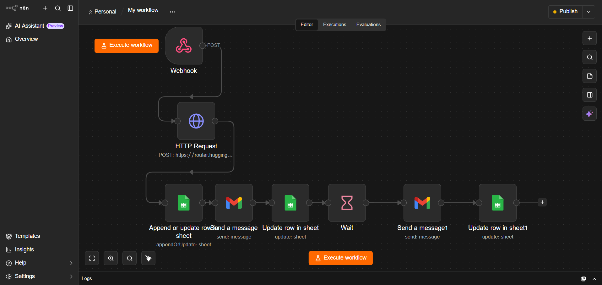

# Real Estate AI Lead Automation

An AI-powered real estate lead automation system built with **n8n, AI, Google Sheets, and Gmail**.

The system automatically captures incoming real estate leads, analyzes and qualifies them using AI, stores the lead information in Google Sheets, sends a personalized email, and performs automated follow-ups.

---

## 🚀 Project Overview

Real estate businesses receive many leads through websites, forms, and other channels. Manually checking every lead and sending follow-up emails can take a lot of time.

This project automates the complete lead-handling process.

## 🔄 Workflow Architecture



The workflow connects lead capture, AI analysis, Google Sheets storage, automated email communication, and follow-up into a single automated pipeline.

### Workflow

```text
Lead / Website Form
        ↓
     Webhook
        ↓
   AI Analysis
        ↓
Lead Classification
 Hot / Warm / Cold
        ↓
   Google Sheets
        ↓
 Personalized Email
        ↓
      Wait
        ↓
   Follow-up Email
        ↓
   Update Lead Status
 .
